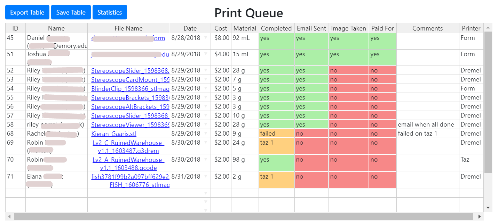

# Order Intake App

## Installation
Requirements: 
	Node.js version 6.4.1+ (https://nodejs.org/en/) 
	SQL Database ([creating database](https://github.com/EmoryTechlab/order-intake-app#creating-database))

```sh
# open a terminal or cmd window and download this app through github or by downloading the zip file
git clone https://github.com/EmoryTechlab/order-intake-app

# navigate to app
cd order-intake-app

# install electron packager
npm install electron-packager -g

# run packager
electron-packager .
```

- navigate to ./order-intake-app-darwin-x64
- open order-intake-app application
- fill out sql database host information
- quit and reload app
- save app icon to shortcut for easy access

## Common Errors
```sh
'npm command not found'
```
--> install Node.js (https://nodejs.org/en/) 

```sh
'permission denied'
```
---> type sudo before the command you are running (this requires admin access)
---> if you don't have admin access & installation of electron packager is failing, try running 'npm install electron-packager' without '-g'

```sh
'electron-packager fails'
```
---> make sure to include the period after electorn-packager in order to use default package settings

### Intake Form:

### Print Queue with sample users and prints:
