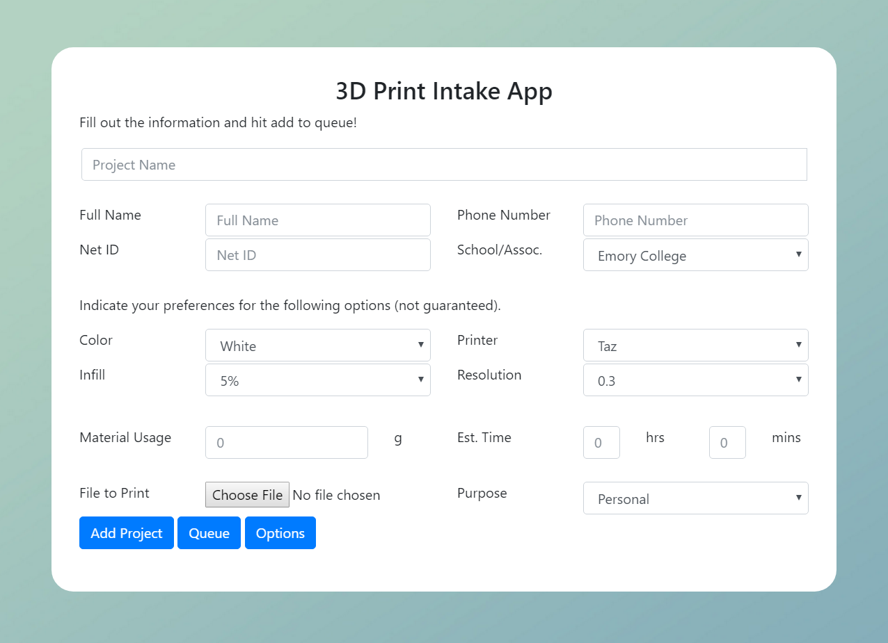

# Order Intake App

## Installation
Requirements
  Node.js version 6.4.1+ (https://nodejs.org/en/)
  SQL Database

```sh
# open a terminal or cmd window and download this app through github or by downloading the zip file
git clone https://github.com/EmoryTechlab/order-intake-app

# navigate to the app page
cd order-intake-app

# install electron packager:
npm install electron-packager -g

# run packager
electron-packager .
```

- navigate to ./order-intake-app-darwin-x64
- open order-intake-app
- fill out sql database host information
- quit reload app
- save app icon to shortcut for easy access

### Intake Form:

### Print Queue with sample users and prints:

